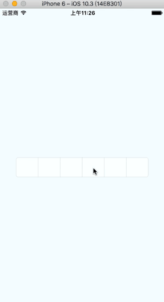

## react-native-pay-password

> 仿支付宝支付密码输入框

### Install

```
$ npm install react-native-pay-password --save
```

### Usage

> 共导出4个组件，其中`PasswordInput`和`PasswordModal`这两个组件已能满足大部分使用情况。需要定制化的时候请使用`InputView`和`Keyboard`两个组件搭配使用。

#### PasswordInput(基于InputView和Keyboard)

```
import { PasswordInput } from 'react-native-pay-password'

export default class App extends Component {

  state = { password: '' }

  render() {
    return (
      <View style={styles.container}>
        <Text style={styles.text}>{this.state.password}</Text>
        <PasswordInput onDone={(data) => { this.setState({ password: data }) }} />
      </View>
    );
  }
}

``` 



| 属性        | 说明           | 类型               | 默认值       |
|------------|----------------|--------------------|--------------|
| onDone   | 支付密码输入后的回调,(password)=>{}   | Function | -  |
| clear    | 打开键盘时是否清空已输入   | boolean  |  true  |
| length    | 支付密码的长度   | number  |  6  |
| borderColor   | 支付密码显示框的边框颜色    | string |  #C7C7C7  |
| style    | 支付密码显示框的样式   | ViewStyle |  -  |
| textStyle    | 支付密码圆点`●`的样式   | TextStyle |  -  |


#### PasswordModal(基于InputView和Keyboard)

> 打开此modal请用refs调用内部show()方法

```
import { PasswordModal } from 'react-native-pay-password'

export default class App extends Component {

  state = { password: '' }

  onPress() {
    this.refs.modal.show();
  }

  render() {
    return (
      <View style={styles.container}>
        <Text style={styles.text} onPress={() => { this.onPress() }}>点击打开支付密码modal</Text>
        <Text style={styles.text}>{this.state.password}</Text>
        <PasswordModal ref='modal' onDone={(data) => { this.setState({ password: data }) }} />
      </View>
    );
  }
}
``` 


| 属性        | 说明           | 类型               | 默认值       |
|------------|----------------|--------------------|--------------|
| onDone   | 支付密码输入后的回调,(password)=>{}   | Function | -  |
| clear    | 打开键盘时是否清空已输入   | boolean  |  true  |
| backdrop    | 打开modal页面是否显示遮罩层   | boolean  |  true  |
| height    | 打开modal页面的高度   | number  |  400  |
| title    | modal页面的标题   | string  |  请输入支付密码  |
| length    | 支付密码的长度   | number  |  6  |
| borderColor   | 支付密码显示框的边框颜色    | string |  #C7C7C7  |
| style    | 支付密码显示框的样式   | ViewStyle |  -  |
| textStyle    | 支付密码圆点`●`的样式   | TextStyle |  -  |


#### InputView(支付密码显示框)

```
import { InputView } from 'react-native-pay-password';
```

| 属性        | 说明           | 类型               | 默认值       |
|------------|----------------|--------------------|--------------|
| length    | 支付密码的长度   | number  |  6  |
| index   | 当前输入的位置   | number | -  |
| borderColor   | 支付密码显示框的边框颜色    | string |  #C7C7C7  |
| style    | 支付密码显示框的样式   | ViewStyle |  -  |
| textStyle    | 支付密码圆点`●`的样式   | TextStyle |  -  |


#### Keyboard(支付密码键盘)

```
import { Keyboard } from 'react-native-pay-password';
```

| 属性        | 说明           | 类型               | 默认值       |
|------------|----------------|--------------------|--------------|
| onPress    | 按下数字`0~9`的回调,(text)=>{}    |  Function |    |
| onDelete   | 按下`删除键`的回调,()=>{}   | Function | -  |
| rerender   | 该组件是否重新渲染    | boolean | true  |